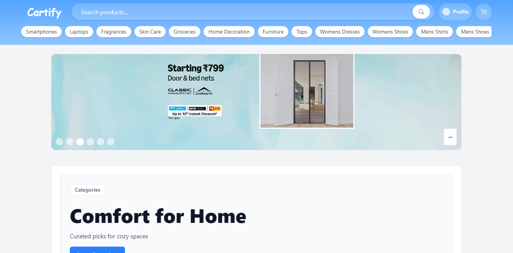
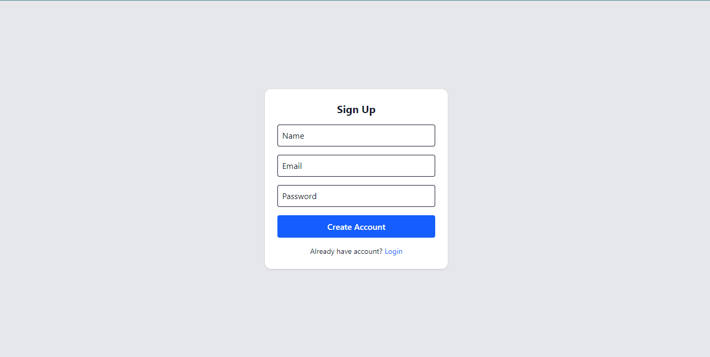
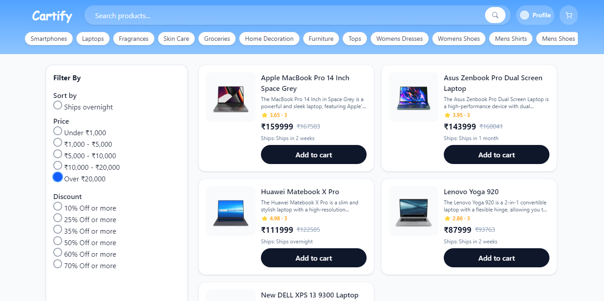
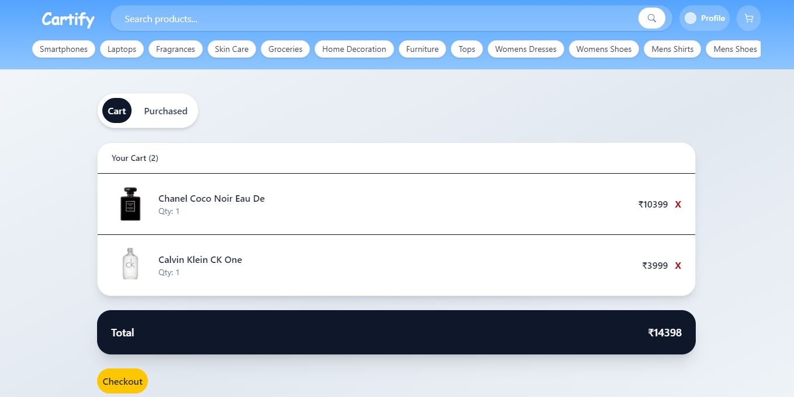

# Cartify

<p align="center">
  <strong>A polished full-stack e-commerce app built to practice real-world authentication, cart persistence, and backend state management.</strong>
</p>

<p align="center">
  <a href="https://caartify.netlify.app/" target="_blank">Live Demo</a>
  ·
  <a href="#screenshots">Screenshots</a>
  ·
  <a href="#features">Key Features</a>
  ·
  <a href="#setup">Setup</a>
</p>

<p align="center">
  
  
  
  
</p>

## Live Demo

Use the app here: [https://caartify.netlify.app/](https://caartify.netlify.app/)

## Why I Built This

Most beginner e-commerce projects focus only on UI. Cartify was built to practice real full-stack concepts like authentication, API design, persistent carts, and backend state management. I wanted a project that felt like a real product flow, not just a static storefront, so the app stores user-specific cart and purchase data, hydrates product details from an API, and keeps the experience tied to a login session.

## Features

- User signup, login, and logout with JWT cookie auth
- Product browsing, search, and category filtering
- Add to cart, remove from cart, and cart total tracking
- Checkout flow with purchase history and purchased total
- Profile page showing expenses total
- Persistent user cart and purchased records in MongoDB
- Responsive UI for desktop and mobile

## Screenshots

### 1. Home


### 2. Login / Sign Up


### 3. Product Listing


### 4. Cart



## Architecture

```text
User
  -> Frontend (React + Vite)
  -> Backend API (Node + Express)
  -> MongoDB (users, cart, purchased)
  -> DummyJSON (product data)
```

## Tech Stack

- Frontend: React, Vite, React Router, Tailwind CSS, React Hot Toast
- Backend: Node.js, Express, Axios
- Database: MongoDB, Mongoose
- Auth: JWT stored in httpOnly cookie
- External API: DummyJSON product catalog

## How It Works

```text
Login / Signup
  -> token cookie is issued

Browse products
  -> frontend reads product data from backend routes

Add to cart
  -> backend stores product id + quantity per user

Checkout
  -> backend moves cart items into purchased records

Profile
  -> frontend fetches checkout total and shows expenses
```

## Project Structure

```text
Cartify/
  Frontend/
    src/
      components/
      api.js
      App.jsx
  Backend/
    app.js
    router/
    models/
    middleswares/
```

## Setup

### Prerequisites

- Node.js 18+
- npm
- MongoDB running locally or a cloud URI

### Install

```bash
cd Frontend
npm install

cd ../Backend
npm install
```

### Environment Variables

Create `Backend/.env`:

```env
MONGO_URI=your_mongodb_connection_string
JWT_SECRET=your_secret_key
PORT=3000
```

### Run the App

Start the backend:

```bash
cd Backend
node app.js
```

Start the frontend in a second terminal:

```bash
cd Frontend
npm run dev
```

## API Overview

- `POST /auth/signup`
- `POST /auth/login`
- `GET /auth/logout`
- `GET /products/search?q=term`
- `GET /products/category/:category`
- `GET /products/:id`
- `POST /products/cart/:id`
- `DELETE /products/cart/:id`
- `GET /products/cart/all`
- `GET /products/cart/total`
- `POST /products/checkout`
- `GET /products/checkout/all`
- `GET /products/checkout/total`

## Challenges Solved

- Keeping cart data tied to the logged-in user instead of local state only
- Hydrating cart and purchase items from product ids
- Handling checkout without losing purchase history
- Keeping totals in sync between cart, purchased items, and profile
- Supporting a smooth auth flow with cookie-based sessions

## Future Improvements

- Add real payment integration
- Store product title and thumbnail directly in purchase records
- Add order status tracking
- Add wishlist support
- Add admin product management
- Add sorting and more advanced filters

## Resume-Friendly Closing

Cartify demonstrates full-stack development with React, Node.js, Express, MongoDB, JWT authentication, and persistent user-specific cart and purchase management.

## Credits

Built by Sameer Hussain.
