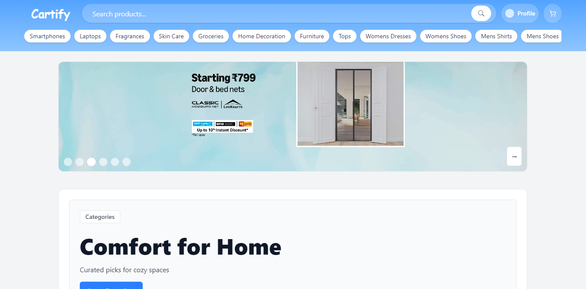
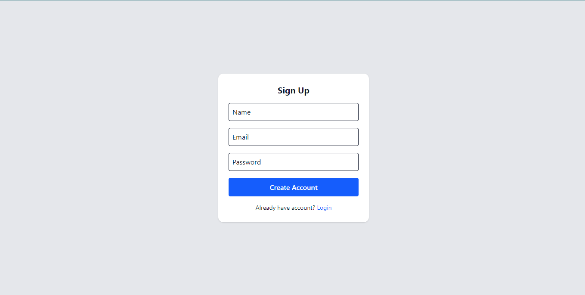
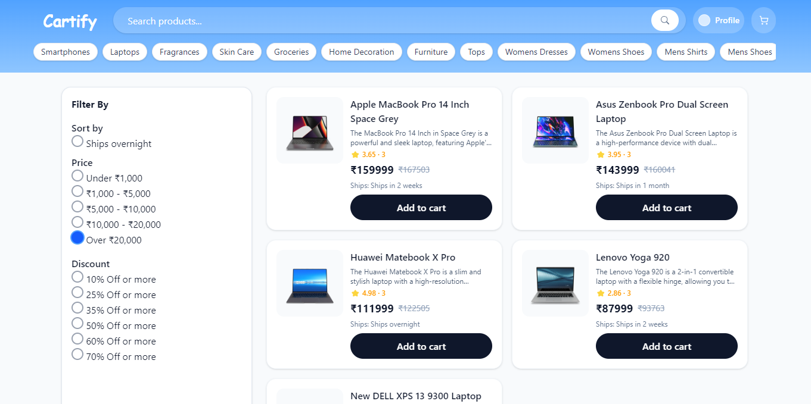
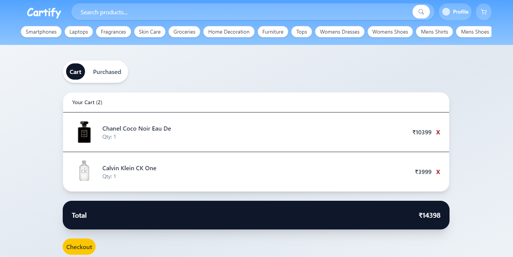

<div align="center">

# Cartify

**A full-stack e-commerce platform with cookie-based JWT auth, a live product catalog, persistent per-user carts, and a role-gated admin dashboard.**

[](https://react.dev/)
[](https://nodejs.org/)
[](https://expressjs.com/)
[](https://www.mongodb.com/)
[](https://tailwindcss.com/)
[](https://vitejs.dev/)

[**Live Demo**](https://caartify.netlify.app) · [Report an Issue](https://github.com/Samonline1/Cartify/issues)

</div>

---

## Table of Contents

- [Overview](#overview)
- [Problem It Solves](#problem-it-solves)
- [Features](#features)
- [Tech Stack](#tech-stack)
- [Architecture](#architecture)
- [API Reference](#api-reference)
- [Folder Structure](#folder-structure)
- [Getting Started](#getting-started)
- [Scripts](#scripts)
- [Engineering Notes](#engineering-notes)
- [Screenshots](#screenshots)
- [Known Limitations & Roadmap](#known-limitations--roadmap)
- [License](#license)
- [Author](#author)

---

## Overview

Cartify is a two-part web application: a React single-page frontend and a Node.js/Express REST API backend. Users can sign up, browse and search a real product catalog (sourced from the public [DummyJSON](https://dummyjson.com/) API), add items to a persistent cart, check out, and review their purchase history and total spend from a profile page. A separate `admin` role can log in to a dedicated dashboard to view store-wide statistics, manage registered users, and browse the product catalog.

Rather than owning its own product inventory, Cartify treats DummyJSON as an external product data source and persists only what's specific to each user — their account, cart contents, and purchase history — in MongoDB. Every cart or purchase line item stores just a `product id` and `quantity`; product details (title, price, images) are fetched from DummyJSON on demand and merged in at read time. That design choice is deliberate: it keeps the project focused on the full-stack concerns it was actually built to demonstrate — authentication, session handling, REST API design, and stateful cart/checkout logic — rather than catalog management.

## Problem It Solves

Most beginner or portfolio e-commerce projects render a static product grid with client-side-only cart state that resets on refresh. Cartify implements the parts of a real storefront that are usually skipped:

- Cart and order data that belongs to an authenticated user and survives across sessions and devices, instead of living in component state.
- A secure, cookie-based authentication flow (`httpOnly` JWT) instead of a token sitting in `localStorage`, where it's readable by any injected script.
- A checkout process that converts cart items into a permanent, timestamped purchase record rather than just clearing an array.
- An administrative view for operational visibility (users, orders, revenue, catalog) without giving admins arbitrary database access — every admin route is scoped to read-only aggregation or explicitly permitted actions.

## Features

**Customer-facing**
- Email/password signup, login, and logout, with the JWT issued as an `httpOnly` cookie (never exposed to client-side JS)
- Product browsing by category with a curated category navigation bar
- Product search by keyword, with a dedicated results page
- Product detail page plus a **quick-view modal** for browsing a product without leaving the current list
- Add to cart / remove from cart, with quantity accumulation on repeat adds
- Live cart total calculation, computed server-side against current DummyJSON pricing
- Checkout flow that snapshots cart items into purchase records and clears the cart
- Purchase history and lifetime spend, shown on a profile page
- Pagination on product listings
- Toast notifications for user feedback (`react-hot-toast`, `react-toastify`)
- Responsive layout with distinct desktop and mobile navigation bars
- Client-side routing, including dynamic `/search/:name`, `/category/:name`, and `/search/:name/:id` routes

**Admin-facing**
- Separate admin login (`/admin`), gated to accounts with an `admin` role
- Client-side route guard (`AdminGuard`) that redirects non-admin users away from the dashboard
- Dashboard overview with aggregate stats: total users, total admins, total products, total categories, total cart items across all users, total orders, and total revenue
- User management: searchable user list, individual user detail view, and user deletion (admin accounts are protected from deletion, enforced server-side)
- Product catalog browser with search, category filter, and sorting by title, price, rating, or stock
- Admin seeding script (`seedAdmin.js`) to bootstrap the first admin account from environment variables

## Tech Stack

| Layer | Technology |
|---|---|
| **Frontend** | React 19, Vite 7, React Router DOM 7, Tailwind CSS 4, Axios, TanStack React Query 5, React Hot Toast / React Toastify, React Icons, React Slick, ESLint |
| **Backend** | Node.js, Express 5, Axios (server-to-server calls to DummyJSON), cookie-parser, cors, dotenv |
| **Database** | MongoDB with Mongoose (ODM) |
| **Auth** | JSON Web Tokens (`jsonwebtoken`), bcrypt password hashing, `httpOnly` cookie delivery, role-based (`user` / `admin`) route middleware |
| **State Management** | TanStack React Query for server state (data fetching, caching, mutations — used throughout, especially the admin dashboard); React Context (`AuthContext`) for session state; local `useState` for UI state |
| **External Data** | [DummyJSON](https://dummyjson.com/) — source of truth for all product data (search, category, single-product lookups) |
| **Hosting** | Netlify (frontend, configured via `netlify.toml`) |

## Architecture

Cartify follows a two-tier client/server architecture with a third-party data dependency:

```text
React SPA (Frontend)
      │  Axios (withCredentials: true)
      ▼
Express REST API (Backend)
      │
      ├─► MongoDB — persists users, cart items (product id + qty), purchase history
      │
      └─► DummyJSON API — supplies product catalog, search, and category data
```

- The frontend never talks to MongoDB or DummyJSON directly; every request goes through the Express backend.
- The backend stores only a product **id** and **quantity** per cart/purchase line item. Whenever cart, checkout, or product data needs to be displayed, the backend fetches the corresponding product from DummyJSON in real time and merges it with the stored quantity/price data — trading a small amount of latency for zero catalog-sync maintenance.
- Authentication is stateless (JWT-based) but delivered via a secure cookie rather than a bearer token; `isLoggedIn` and `isAdmin` Express middleware guard protected routes and attach the decoded token payload to `req.user`.
- On the frontend, React Router defines a shared `Layout` (navbar + footer) for customer-facing routes, while `/admin` and `/admin/dashboard` sit outside that layout and are protected by a client-side `AdminGuard` component that checks the cached user role.

## API Reference

All endpoints are prefixed with the backend's base URL (e.g. `/api`). Routes marked  require a valid `token` cookie (`isLoggedIn`); routes marked  additionally require `role: "admin"` (`isAdmin`).

**Auth** — `/api/auth`

| Method | Route | Description |
|---|---|---|
| POST | `/signup` | Create a user account, hash the password, issue a JWT cookie |
| POST | `/login` | Verify credentials, issue a JWT cookie |
| GET | `/logout` | Clear the auth cookie |

**Products & Cart** — `/api/products`

| Method | Route | Description |
|---|---|---|
| GET | `/search?q=` | Search the DummyJSON catalog by keyword |
| GET | `/category/:category` | List products in a category |
| GET | `/:id` | Get a single product's details |
| GET | `/cart/all`  | Return the current user's cart, enriched with live product data |
| GET | `/cart/total`  | Return the current cart's total value |
| POST | `/cart/:id`  | Add a product to the cart (increments quantity if already present) |
| DELETE | `/cart/:id`  | Remove a product from the cart |
| POST | `/checkout`  | Convert the cart into purchase records and empty the cart |
| GET | `/checkout/all`  | Return purchase history |
| GET | `/checkout/total`  | Return lifetime spend |

**Admin** — `/api/admin`

| Method | Route | Description |
|---|---|---|
| POST | `/login` | Admin-only login (rejects non-admin accounts) |
| POST | `/logout` | Clear the admin auth cookie |
| GET | `/me`  | Return the logged-in admin's profile |
| GET | `/dashboard`  | Aggregate store stats: users, admins, products, categories, cart items, orders, revenue |
| GET | `/users`  | List/search all users (name/email match) with cart & purchase counts |
| GET | `/users/:id`  | Get a single user's detail |
| DELETE | `/users/:id`  | Delete a non-admin user (admin accounts are protected server-side) |
| GET | `/products`  | Browse the catalog with search, category filter, and sort |

## Folder Structure

```text
Cartify/
├── Backend/
│   ├── app.js                    # Express entrypoint: middleware, CORS allow-list, route mounting, server start
│   ├── seedAdmin.js               # One-off script to create the first admin user from env vars
│   ├── config/
│   │   └── catalog.js             # Reads CATALOG_BASE_URL; throws at boot if it's not set
│   ├── models/
│   │   ├── db.js                  # Mongoose/MongoDB connection logic
│   │   └── user.js                # User schema: name, email, password, role, cart[], purchased[]
│   ├── middleswares/
│   │   └── middlesware.js         # isLoggedIn (JWT verification) and isAdmin (role check) guards
│   ├── controllers/
│   │   └── productsController.js  # Thin HTTP layer over the product/cart services
│   ├── services/
│   │   ├── catalogService.js      # DummyJSON calls: search, by-category, by-id
│   │   └── cartService.js         # Cart/checkout business logic, totals, purchase history
│   └── router/
│       ├── authRouter.js          # /api/auth   — signup, login, logout
│       ├── adminRouter.js         # /api/admin  — admin auth, dashboard stats, user & product management
│       └── productsRouter.js      # /api/products — search, category, product detail, cart, checkout
│
├── Frontend/
│   ├── index.html
│   ├── vite.config.js              # Vite config: React + Tailwind plugins, dev server on port 5173
│   ├── eslint.config.js
│   └── src/
│       ├── main.jsx                # App bootstrap: React Query client, AuthProvider, Toaster
│       ├── App.jsx                 # Route table (React Router) + AdminGuard
│       ├── api.js                  # Axios instance (baseURL from VITE_API_URL, withCredentials: true)
│       ├── api/products.js         # All product/cart/checkout API calls
│       ├── AuthContext.jsx         # React Context for the current (non-sensitive) user object
│       ├── hooks/
│       │   ├── queries/            # React Query hooks: home products, search, category, cart, admin data...
│       │   └── mutations/          # React Query hooks: checkout, delete cart item
│       ├── components/
│       │   ├── Layout.jsx          # Shared shell: Navbar/NavbarMobile + Footer + <Outlet />
│       │   ├── Navbar.jsx / NavbarMobile.jsx
│       │   ├── ProductQuickView.jsx
│       │   ├── Pagination.jsx
│       │   └── home/                # Hero, category rail, brand rail, product sections, loading/error states
│       └── pages/
│           ├── Home.jsx, SearchResults.jsx, CatergoryResults.jsx, ProductDetails.jsx
│           ├── Cart.jsx, Checkout.jsx, Profile.jsx
│           ├── SignUp.jsx, AdminLogin.jsx, AdminDashboard.jsx
│
├── docs/screenshots/                # home.png, login.png, products.png, cart.png
├── netlify.toml                     # Netlify build config (base: Frontend, publish: dist)
└── README.md
```

## Getting Started

### Prerequisites

- Node.js 18+
- npm
- A MongoDB instance (local, or a hosted cluster such as MongoDB Atlas)

### Installation

There's no root-level workspace, so the frontend and backend are installed separately:

```bash
git clone https://github.com/Samonline1/Cartify.git
cd Cartify

# Backend
cd Backend
npm install

# Frontend
cd ../Frontend
npm install
```

### Environment Variables

No `.env` is committed (it's git-ignored). Based on the code, these are the variables each side reads:

**`Backend/.env`**

| Variable | Required | Purpose |
|---|---|---|
| `MONGO_URI` | Yes | MongoDB connection string used by `models/db.js` |
| `JWT_SECRET` | Yes | Secret used to sign/verify JWTs. Auth routes return `500` if it's missing |
| `PORT` | Yes | Port Express listens on — `app.js` throws at startup if this is unset |
| `CATALOG_BASE_URL` | Yes | Base URL for the product data source (e.g. `https://dummyjson.com/products`). `config/catalog.js` throws at startup if this is unset, since almost every product/cart/admin route depends on it |
| `NODE_ENV` | No | When `production`, auth cookies are issued with `secure: true` and `sameSite: "none"` for cross-site use (e.g. Netlify frontend → separately-hosted API) |
| `CLIENT_URL` | No | Extra allowed CORS origin, appended to the hardcoded allow-list in `app.js` |
| `ADMIN_EMAIL` / `ADMIN_PASSWORD` | Yes, for seeding | Credentials `seedAdmin.js` uses to create the first admin account |
| `ADMIN_NAME` | No | Display name for the seeded admin; defaults to `"Admin"` |

**`Frontend/.env`**

| Variable | Required | Purpose |
|---|---|---|
| `VITE_API_URL` | No | Base URL for the backend API used by the Axios instance in `src/api.js`; falls back to `http://localhost:5000/api` |

> The CORS allow-list in `app.js` includes `http://localhost:3000` alongside the deployed Netlify domains, while the frontend's own local fallback points at port `5000`. If you run the backend on a different port, set `PORT` (backend) and `VITE_API_URL` (frontend) to match.

### Run Locally

```bash
# Terminal 1 — backend
cd Backend
node app.js

# optional, once: seed the first admin account (requires ADMIN_EMAIL / ADMIN_PASSWORD)
node seedAdmin.js
```

```bash
# Terminal 2 — frontend
cd Frontend
npm run dev
```

The frontend dev server runs at `http://localhost:5173` and expects the backend at the URL configured by `VITE_API_URL`.

## Scripts

**Backend** (`Backend/package.json`)

No `start`/`dev` script is defined yet — the server is run directly with `node app.js` (or `node seedAdmin.js` for seeding). `npm test` is a placeholder; no test suite exists yet.

**Frontend** (`Frontend/package.json`)

| Script | Command | Description |
|---|---|---|
| `dev` | `vite` | Starts the Vite dev server with hot module reloading |
| `build` | `vite build` | Builds an optimized production bundle into `dist/` |
| `lint` | `eslint .` | Runs ESLint against the project source |
| `preview` | `vite preview` | Serves the production build locally for verification |

## Engineering Notes

A few decisions worth calling out, since they're the parts of this project that go beyond a CRUD tutorial:

- **Cart/purchase records store an id + quantity, not a product snapshot.** This keeps the schema small and avoids catalog duplication, but it means historical purchase prices can drift if DummyJSON's prices change after checkout — a known trade-off documented in the roadmap below rather than hidden.
- **Auth token vs. auth state are intentionally separate.** The JWT itself lives only in an `httpOnly` cookie and is never touched by frontend JS. `AuthContext` mirrors a *non-sensitive* user object (name/email/role) in `localStorage` purely so the UI can render the right nav state on refresh — the actual authorization decision on every protected request is re-verified server-side against the cookie, not trusted from that cached object.
- **Admin destructive actions are guarded at the data layer, not just the UI.** `DELETE /admin/users/:id` re-checks the target's role server-side and rejects deleting admin accounts, so the protection holds even if the client were bypassed entirely.
- **The product catalog has no local write path by design.** Every product-facing endpoint proxies to DummyJSON rather than mirroring it into MongoDB — a scope decision to keep the project's surface area on session/cart/order logic instead of building a second inventory system.

## Screenshots

### Home


### Login / Sign Up


### Product Listing


### Cart



## Author

**Sameer H**
GitHub: [@Samonline1](https://github.com/Samonline1)
